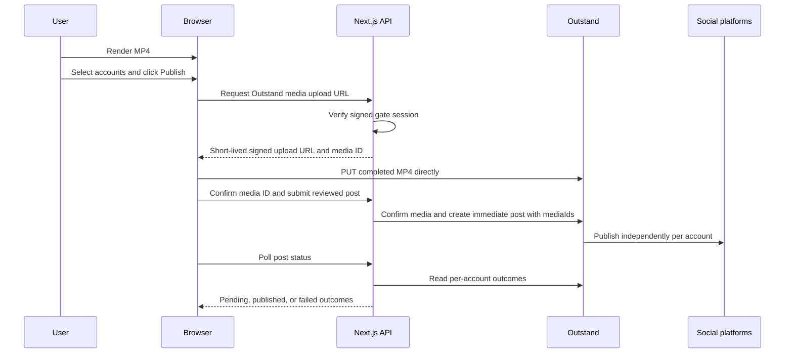

# Introduction

Add a sixth Publish step to the VideoMaker workflow. The user selects connected
social accounts, reviews platform-specific recommendations and settings, and
clicks Publish before any external post is created. The application requests an
Outstand signed media URL, uploads the rendered MP4 directly from the browser,
confirms the resulting media ID, and creates the post. Large video bytes never
pass through a Vercel Function request body.

### Architecture Amendment

Version 1.2 supersedes the Vercel Blob handoff in version 1.1. Outstand's
documented create-post contract accepts media IDs produced by its Media API; it
does not document arbitrary external media URLs as create-post input. The
implemented flow therefore uses Outstand's signed direct-upload URL and
`mediaIds`. All requirements, tasks, tests, dependencies, files, risks, and
assumptions below that require Vercel Blob staging are withdrawn.

This amendment keeps the original safety properties: rendering remains local,
video bytes bypass Next.js Functions, no upload starts before explicit
confirmation, and provider credentials remain server-only. Pinterest publishing
is disabled until board discovery and validated `board_id` selection are added.

### Rendering Decision

Keep MP4 generation local in version 1. The existing `lib/render.ts` pipeline is
client-only, processes one scene at a time, and removes intermediate files from
FFmpeg memory. This keeps source media on the user's device, avoids render
compute charges, and avoids Vercel Function duration, memory, request-body, and
native-binary packaging limits. Only the completed MP4 leaves the browser after
the user confirms Publish.

| Consideration | Local browser rendering | Remote rendering |
|---------------|-------------------------|------------------|
| Source-media privacy | Source photos, clips, voice tracks, and intermediates remain on the device | All source media must be uploaded and retained long enough to render |
| Infrastructure cost | Uses the user's CPU and memory; no render worker or queue cost | Requires compute, queueing, temporary source storage, output storage, and transfer |
| Vercel compatibility | Avoids long-running server work and native FFmpeg packaging | Does not fit a standard Vercel Function reliably; requires a dedicated render worker |
| Time to implement | Reuses the working FFmpeg WASM pipeline | Requires upload orchestration, job state, retries, worker security, and cleanup |
| Device experience | Performance varies by browser and hardware; the tab must remain open | Predictable worker performance; the user can leave after submission |
| Reliability | Browser closure, memory pressure, or sleep can interrupt rendering | Durable queues can retry failed or interrupted jobs |
| Output consistency | Browser implementations and available resources can vary | A pinned container and FFmpeg build produce deterministic output |
| Multi-format output | Each 16:9, 9:16, or 1:1 output requires another local render | Workers can render several profiles in parallel from one uploaded project |
| Scalability | Best for interactive, short, user-initiated videos | Best for batch, scheduled, unattended, or high-volume production |

Remote rendering is a future architecture, not a Vercel Function variation. If
adopted, use a containerized FFmpeg worker, durable job queue, private source
storage, signed upload and download URLs, idempotent jobs, and automatic source
and output retention policies.

## 1. Requirements & Constraints

* REQ-001: Add a dedicated Publish step after Render without removing MP4
  preview, download, or rerender controls.
* REQ-002: List connected Outstand accounts with account ID, network, nickname,
  username, profile image, active state, and health state.
* REQ-003: Allow selection of specific account IDs. Never target accounts by a
  non-unique network name or username when creating a post.
* REQ-004: Provide Connect account and Change account actions through Outstand's
  OAuth URL flow. Never collect social-network passwords in the application.
* REQ-005: Support X, LinkedIn, Instagram, TikTok, Facebook, Threads, Bluesky,
  YouTube, Google Business Profile, and Vimeo when matching connected accounts
  exist. Defer Pinterest until board selection is implemented.
* REQ-006: Require an explicit Publish button click after the user reviews the
  selected accounts, caption, title, media profile, disclosures, privacy, and
  platform-specific settings.
* REQ-007: Publish immediately in version 1. Do not implement scheduled posts.
* REQ-008: Show upload progress, Outstand submission progress, and independent
  pending, published, or failed results for every selected social account.
* REQ-009: Preserve failed-account details and permit retrying only failed
  accounts without duplicating successful posts.
* REQ-010: Request an Outstand signed upload URL through an authenticated route,
  then upload the rendered `video/mp4` directly from the browser to that URL.
  A Vercel Function must not receive or proxy the MP4 bytes.
* REQ-011: Expose direct upload progress in the Publish step and reject videos
  above the configured 500 MB application limit before confirmation.
* REQ-012: Confirm the Outstand media ID server-side before creating a post and
  pass only confirmed `mediaIds` to the create-post endpoint.
* REQ-013: Retain the confirmed media ID in memory for failed-account retries so
  successful accounts are never targeted twice.
* REQ-014: Allow bounded status polling to resume without creating another post.
* REQ-015: Keep the rendered Blob in an in-memory render-output registry rather
  than Zustand, IndexedDB, local storage, or a JSON API payload.
* REQ-016: Recommend the current 16:9 profile for YouTube, LinkedIn, Facebook,
  X, Vimeo, and Google Business; 9:16 for TikTok, Instagram Reels, Facebook
  Reels, YouTube Shorts, and Threads; and 1:1 for square-feed use cases.
* REQ-017: Detect profile mismatches before upload and provide a one-click path
  back to rerender. Do not silently crop, stretch, or create a second render.
* REQ-018: Validate duration, dimensions, aspect ratio, file size, caption
  length, required titles, required Pinterest board selection, privacy options,
  made-for-kids settings, and disclosure controls against a versioned platform
  configuration.
* REQ-019: Permit platform-specific text and settings while retaining a shared
  caption as the default.
* REQ-020: Keep MP4 rendering in the browser for version 1 and upload only the
  completed MP4 after explicit Publish confirmation.
* REQ-021: Preserve one-scene-at-a-time encoding and immediate intermediate-file
  cleanup in the local FFmpeg pipeline.
* REQ-022: Display a local-render readiness check before rendering. Warn when
  cross-origin isolation, `SharedArrayBuffer`, required browser APIs, memory, or
  supported browser conditions are unavailable.
* REQ-023: Preserve the local MP4 download when rendering succeeds but Outstand
  publishing is unavailable.
* REQ-024: Record local render duration, output duration, output size, completion,
  cancellation, and a non-sensitive failure category for evaluating whether a
  remote renderer is justified. Do not record source media or generated text.
* SEC-001: Revoke the Outstand API key disclosed in chat before implementation.
  Configure only a replacement value as the server-side `OUTSTAND_API_KEY`.
* SEC-002: Store `OUTSTAND_API_KEY` only in Vercel environment variables and
  local ignored environment files. Never use a `NEXT_PUBLIC_*` variable.
* SEC-003: Replace the current non-cryptographic gate token with an HMAC-SHA-256
  signed session value before enabling Outstand write operations. Verify
  signatures with a timing-safe comparison.
* SEC-004: Require a valid signed gate session for account listing, account
  health, OAuth URL generation, media upload authorization, media confirmation,
  post creation, status polling, and retry.
* SEC-005: Disable social publishing when `APP_PASSWORD` or `OUTSTAND_API_KEY`
  is absent. Return configuration state without returning secret values.
* SEC-006: Request Outstand upload URLs only for sanitized `.mp4` filenames and
  confirm a positive size no larger than the configured 500 MB maximum.
* SEC-007: Validate every Outstand media, account, and post ID before use.
* SEC-008: Call `GET /v1/social-accounts` with `includeTokens=false`. Never return
  provider OAuth tokens to the browser.
* SEC-009: Validate all browser input with Zod, apply same-origin checks to write
  routes, redact upstream error bodies, and rate-limit upload and publish calls.
* SEC-010: Send only Outstand account IDs and allowlisted platform settings from
  the browser. Re-resolve and validate selected account IDs server-side.
* CON-001: Do not automatically publish after render, upload, OAuth return, or
  account selection.
* CON-002: Do not add `middleware.ts` or restore the deleted Vercel function
  configuration. Protect each new route through shared server helpers.
* CON-003: Do not proxy video bytes through a Vercel Function.
* CON-004: Do not add an intermediate public storage layer unless a documented
  provider contract requires it.
* CON-005: Do not claim that one render is optimal for incompatible aspect
  ratios. Warn clearly and require rerendering when the selected destinations
  need another profile.
* CON-006: Do not move FFmpeg rendering into a Next.js route or Vercel Function.
  A future remote renderer requires a separately deployed durable worker.
* GUD-001: Keep Outstand calls in a server-only client with typed request and
  response contracts and bounded timeouts.
* GUD-002: Treat each Outstand account result independently because one
  platform can succeed while another fails.
* GUD-003: Reassess remote rendering after at least 100 production render
  attempts if the non-user-cancelled failure rate exceeds 5 percent, or sooner
  if background rendering, batch generation, or parallel multi-format output
  becomes a committed requirement.

## 2. Implementation Steps

### Implementation Phase 1

* GOAL-001: Establish secure configuration and publishing authorization.

| Task | Description | Completed | Date |
|------|-------------|-----------|------|
| TASK-001 | Revoke the disclosed Outstand key, create a replacement, and configure `OUTSTAND_API_KEY` only in Vercel Production, Preview, and Development environments |  |  |
| TASK-002 | Configure the replacement `OUTSTAND_API_KEY` only in Vercel Production, Preview, and Development environments |  |  |
| TASK-003 | Add sanitized `OUTSTAND_API_KEY` and `SOCIAL_VIDEO_MAX_BYTES=524288000` entries to `env.example` | Yes | 2026-07-20 |
| TASK-004 | Replace `expectedToken()` in `lib/server/gate.ts` with HMAC-SHA-256 session creation and timing-safe verification derived from `APP_PASSWORD`; update `app/api/gate/route.ts` to set `Secure` in production | Yes | 2026-07-20 |
| TASK-005 | Add `requirePublishingSession()` and same-origin validation in `lib/server/publishing-auth.ts`; reject publishing operations when `APP_PASSWORD` is not configured | Yes | 2026-07-20 |
| TASK-006 | Add bounded upload and publish throttles in `lib/server/throttle.ts` | Yes | 2026-07-20 |

### Implementation Phase 2

* GOAL-002: Add direct-to-Outstand media transfer without server-side video
  bytes.

| Task | Description | Completed | Date |
|------|-------------|-----------|------|
| TASK-007 | Add authenticated media upload authorization and confirmation routes using Outstand's Media API | Yes | 2026-07-20 |
| TASK-008 | Upload the MP4 directly from the browser to Outstand's signed URL with content type and progress reporting | Yes | 2026-07-20 |
| TASK-009 | Validate media ID, status, content type, and size before post creation | Yes | 2026-07-20 |
| TASK-010 | Enforce the 500 MB application limit and sanitized `.mp4` filenames | Yes | 2026-07-20 |
| TASK-011 | Add `lib/render-output.ts` as a module-scoped in-memory registry that replaces prior object URLs safely and exposes the latest `RenderOutput.blob` to the Publish step | Yes | 2026-07-20 |
| TASK-012 | Update `components/RenderStep.tsx` to register the successful render output without placing the Blob in Zustand or IndexedDB | Yes | 2026-07-20 |

### Implementation Phase 3

* GOAL-003: Implement the server-only Outstand integration and account flow.

| Task | Description | Completed | Date |
|------|-------------|-----------|------|
| TASK-013 | Add exact Outstand account, OAuth, post, media, and per-account status contracts in `lib/outstand/types.ts` | Yes | 2026-07-20 |
| TASK-014 | Add `lib/server/outstand.ts` with Bearer authentication, JSON validation, abort timeouts, safe error mapping, and methods for connected accounts, health, auth URL, media, post creation, and post details | Yes | 2026-07-20 |
| TASK-015 | Add `app/api/publish/accounts/route.ts` to return connected accounts with `includeTokens=false` and normalized health metadata | Yes | 2026-07-20 |
| TASK-016 | Add `app/api/publish/connect/route.ts` to request an Outstand OAuth URL for an allowlisted network and a fixed application callback URL | Yes | 2026-07-20 |
| TASK-017 | Add `app/create/publish/callback/page.tsx` to handle OAuth success or failure, refresh connected accounts through a popup, and return to Publish without posting | Yes | 2026-07-20 |
| TASK-018 | Handle Bluesky separately with an explicit unsupported-in-app connection message; allow already connected Bluesky accounts to publish | Yes | 2026-07-20 |
| TASK-019 | Add `app/api/publish/posts/route.ts` to revalidate account IDs, content, and confirmed media IDs, then create an immediate Outstand post | Yes | 2026-07-20 |
| TASK-020 | Add `app/api/publish/posts/[id]/route.ts` to return normalized per-account outcomes and support resumable polling | Yes | 2026-07-20 |
| TASK-021 | Add failed-account retry handling that targets only failed account IDs and reuses the confirmed media ID | Yes | 2026-07-20 |

### Implementation Phase 4

* GOAL-004: Add platform selection, optimization guidance, and explicit publish
  controls.

| Task | Description | Completed | Date |
|------|-------------|-----------|------|
| TASK-022 | Add `config/social-platforms.ts` with canonical network names, accepted profiles, media constraints, text constraints, required fields, and supported Outstand settings |  |  |
| TASK-023 | Add serializable account selections, shared caption, per-platform overrides, settings, and publish-result state to `lib/types.ts` and `lib/store.ts`; exclude secrets, OAuth tokens, and media bytes |  |  |
| TASK-024 | Add `components/PublishStep.tsx` with account identity, profile image, health, platform selection, Change account, refresh, caption fields, settings, validation warnings, and review summary |  |  |
| TASK-025 | Add stable upload, submit, pending, partial-success, complete, failed, retry, cancel, and expired-media states with progress indicators and accessible status announcements |  |  |
| TASK-026 | Add a final confirmation dialog that names every target account and states that clicking Publish sends the video externally; invoke upload and post creation only after confirmation | Yes | 2026-07-20 |
| TASK-027 | Extend `WizardStep`, `Stepper`, and `app/create/page.tsx` with step 6, Publish; preserve Download as a valid terminal action when publishing is unavailable | Yes | 2026-07-20 |
| TASK-028 | Revise privacy text to state that source media and rendering remain local, while the final MP4 is uploaded only after Publish is confirmed | Yes | 2026-07-20 |

### Implementation Phase 5

* GOAL-005: Validate, document, deploy, and observe the complete publishing
  lifecycle.

| Task | Description | Completed | Date |
|------|-------------|-----------|------|
| TASK-029 | Add unit tests for platform validation, signed gate sessions, account-ID resolution, status normalization, retry targeting, and media validation | Partial: gate, origin, provider ID, media validation, retry, and polling decisions | 2026-07-20 |
| TASK-030 | Add route tests proving unauthenticated requests, invalid media IDs, oversized files, unknown account IDs, invalid settings, and duplicate submissions are rejected |  |  |
| TASK-031 | Add browser tests for account display, popup OAuth return, profile mismatch, explicit confirmation, direct upload, progress, partial failure, retry, and resumable polling |  |  |
| TASK-032 | Run `npm run build`, the added test suite, and a production deployment smoke test without using real social accounts | Partial: 8 tests, build, and zero-vulnerability runtime audit pass; production smoke test pending | 2026-07-20 |
| TASK-033 | Run one user-approved live post to a designated test account, verify the native platform URL and video playback, and delete the test post if requested |  |  |
| TASK-034 | Verify Outstand media retention and deletion behavior for successful and abandoned uploads |  |  |
| TASK-035 | Update `README.md` with setup, account connection, direct-upload behavior, limits, troubleshooting, data retention, and secret-rotation instructions | Yes | 2026-07-20 |
| TASK-036 | Update this plan with completion dates, validation evidence, final platform coverage, and any accepted deviations | Yes | 2026-07-20 |
| TASK-037 | Add a pre-render capability check for cross-origin isolation, `SharedArrayBuffer`, required browser APIs, and supported-browser conditions; preserve MP4 download when publishing services are unavailable |  |  |
| TASK-038 | Add privacy-preserving local render measurements for duration, output duration, output size, completion, cancellation, and categorized failure without storing source media or generated content |  |  |
| TASK-039 | After 100 production attempts, review render failure rate and user-device constraints against GUD-003 and record whether remote-render discovery is warranted |  |  |

## 3. Alternatives

* ALT-001: Upload the MP4 through a Next.js route and then write it to Blob.
  Rejected because Vercel recommends client uploads above 4.5 MB, and proxying
  video bytes would add request-body, memory, timeout, and transfer-cost risk.
* ALT-002: Upload the browser Blob directly to Outstand's signed media URL.
  Selected because this is Outstand's documented Media API flow and returns the
  media ID required by create-post requests.
* ALT-003: Use a private Vercel Blob and proxy reads to Outstand. Rejected
  because private delivery requires a Vercel Function, which reintroduces the
  large-response and execution-duration risks the design is intended to remove.
* ALT-004: Store video bytes in Zustand, IndexedDB, or a database. Rejected
  because large binary state increases memory and persistence risk and is not
  required after direct Blob upload.
* ALT-005: Create one render per selected platform automatically. Deferred
  because it can multiply render time, storage, and publication ambiguity. The
  first release provides deterministic recommendations and explicit rerendering.
* ALT-006: Add scheduled publishing. Deferred because the current requirement is
  an explicit Publish action and scheduling conflicts with a 24-hour temporary
  Blob retention policy.
* ALT-007: Render MP4 remotely. Deferred because the current browser pipeline is
  already implemented, keeps source media local, has no render-worker cost, and
  avoids Vercel Function limits. Reconsider a separate containerized worker when
  GUD-003 is met or when unattended, scheduled, batch, or parallel multi-format
  rendering becomes required.

## 4. Dependencies

* DEP-001: A replacement Outstand API key configured as `OUTSTAND_API_KEY`
* DEP-002: At least one healthy social account connected in Outstand
* DEP-003: `APP_PASSWORD` configured for signed publishing authorization
* DEP-004: Existing browser FFmpeg rendering and 16:9, 9:16, and 1:1 profiles
* DEP-005: Existing Zustand, App Router, and route-level throttle patterns

## 5. Files

* FILE-001: `package.json` and `package-lock.json`, preserve the existing runtime
  dependencies
* FILE-002: `env.example`, document sanitized publishing configuration
* FILE-003: `lib/server/gate.ts` and `app/api/gate/route.ts`, harden the signed
  publishing session
* FILE-004: `lib/server/publishing-auth.ts`, centralize route authorization and
  same-origin checks
* FILE-005: `app/api/publish/media/route.ts` and
  `app/api/publish/media/confirm/route.ts`, authorize and confirm Outstand media
* FILE-006: `lib/render-output.ts`, retain the latest rendered Blob in memory
* FILE-007: `lib/outstand/types.ts` and `lib/server/outstand.ts`, implement typed
  server-only Outstand access
* FILE-008: `config/social-platforms.ts`, define platform profiles and settings
* FILE-009: `components/PublishStep.tsx`, perform direct signed media uploads
* FILE-010: `app/api/publish/accounts/route.ts`, list safe account metadata
* FILE-011: `app/api/publish/connect/route.ts`, begin account OAuth
* FILE-012: `app/api/publish/posts/route.ts`, validate and create posts
* FILE-013: `app/api/publish/posts/[id]/route.ts`, poll outcomes and clean media
* FILE-014: `app/create/publish/callback/page.tsx`, complete the account-return UI
* FILE-015: `components/PublishStep.tsx`, implement review and publishing UI
* FILE-016: `components/RenderStep.tsx`, register render output for publishing
* FILE-017: `components/Stepper.tsx` and `app/create/page.tsx`, add step 6
* FILE-018: `lib/types.ts` and `lib/store.ts`, add serializable publish state
* FILE-019: `app/globals.css`, add styles consistent with the existing interface
* FILE-020: `README.md`, document setup, operation, security, and retention
* FILE-021: `plan/feature-outstand-social-publishing-1.md`, track execution and
  evidence

## 6. Testing

* TEST-001: Verify MP4 bytes travel from the browser directly to Outstand's
  signed upload URL and do not appear in any Next.js API request body.
* TEST-002: Verify direct uploads report progress and preserve local download on
  transfer failure.
* TEST-003: Verify media authorization and confirmation reject unauthenticated
  sessions, invalid IDs, invalid sizes, and oversized files.
* TEST-004: Verify only metadata without OAuth tokens is returned for connected
  accounts and account health is visible.
* TEST-005: Verify Change account opens Outstand OAuth, returns to Publish,
  refreshes the account list, and does not trigger a post.
* TEST-006: Verify no upload or Outstand write occurs before the final Publish
  confirmation.
* TEST-007: Verify selected account IDs, shared and overridden captions, and
  allowlisted platform settings map to the expected Outstand request.
* TEST-008: Verify an incompatible render profile blocks Publish and routes the
  user to rerender without losing caption or account selections.
* TEST-009: Verify mixed published, failed, and pending account results display
  independently and retry targets failed accounts only.
* TEST-010: Verify status monitoring can resume after a bounded polling window
  without creating another post.
* TEST-011: Verify failed-only retry reuses the confirmed media ID and excludes
  every account that already published.
* TEST-012: Verify build output contains no Outstand key, provider OAuth token,
  signed media URL, or rendered video bytes.
* TEST-013: Verify the production app remains cross-origin isolated and existing
  rendering, download, TTS, and rerender flows still pass.
* TEST-014: Verify the native test post contains playable video with correct
  aspect ratio, caption, title, privacy, and disclosure settings.
* TEST-015: Verify local rendering uploads no source photo, clip, voice track,
  subtitle intermediate, or FFmpeg temporary file to the application server.
* TEST-016: Verify closing or cancelling a local render does not request an
  Outstand media URL or create a post.
* TEST-017: Verify unsupported browser capabilities block rendering with a clear
  recovery message and do not begin an Outstand upload.
* TEST-018: Verify render measurements contain only duration, output size,
  completion state, cancellation state, and a categorized error code.
* TEST-019: Benchmark one representative project on supported desktop and mobile
  browsers and record render time, peak browser memory when observable, output
  size, and successful MP4 playback.

## 7. Risks & Assumptions

* RISK-001: Outstand signed upload URLs are bearer credentials. Return them only
  to authenticated same-origin requests and never log or persist them.
* RISK-002: A confirmed Outstand media object can outlive an abandoned browser
  session. Provider retention and deletion behavior must be verified before the
  live pilot expands beyond a trusted small group.
* RISK-003: A browser refresh loses the in-memory rendered MP4 and confirmed
  media ID. Keep account OAuth in a popup and preserve local download.
* RISK-004: Large direct uploads depend on browser and Outstand transfer limits.
  Enforce the application limit and report transfer failures without posting.
* RISK-005: Platform constraints and Outstand fields can change. Keep the
  platform matrix versioned and reject unknown settings instead of forwarding
  them.
* RISK-006: One MP4 cannot be ideal for both landscape and vertical platforms.
  The UI must distinguish compatible targets from destinations that require a
  rerender.
* RISK-007: OAuth callbacks can fail or return an unhealthy account. Refresh and
  health-check the account before enabling its selection.
* RISK-008: Outstand may partially publish a multi-account post. Store and render
  each account outcome and never retry the whole selection automatically.
* RISK-009: Outstand usage limits can temporarily disable publishing. Detect
  provider errors and preserve local download as the fallback.
* RISK-010: Local rendering consumes user CPU, memory, and battery and can be
  interrupted by tab closure, device sleep, browser memory pressure, or thermal
  throttling. Provide progress, cancellation, capability checks, and rerun
  guidance.
* RISK-011: Local rendering is slower and less predictable on low-powered mobile
  devices. Use production measurements and GUD-003 rather than assumption to
  decide whether to add a remote worker.
* RISK-012: A future remote renderer would expand the privacy and security scope
  by uploading source media and would require durable jobs, private storage,
  retention controls, worker isolation, and additional operational cost.
* ASSUMPTION-001: Outstand accepts confirmed Media API IDs in create-post
  requests, as specified by its current documentation.
* ASSUMPTION-002: Immediate posts normally reach a terminal Outstand outcome
  within the resumable polling period.
* ASSUMPTION-003: The application remains a single-user or trusted-small-group
  deployment protected by `APP_PASSWORD`; multi-tenant identity is out of scope.
* ASSUMPTION-004: The user will choose and approve the first real test account
  and will click Publish for every live test.

## 8. Related Specifications / Further Reading

* [Current Vercel deployment plan](./infrastructure-videomaker-vercel-1.md)
* [Outstand getting started](https://www.outstand.so/docs/getting-started)
* [Outstand connected social accounts](https://www.outstand.so/docs/list-connected-social-accounts)
* [Outstand OAuth URL](https://www.outstand.so/docs/get-social-network-authentication-url)
* [Outstand media upload URL](https://www.outstand.so/docs/get-upload-url)
* [Outstand media confirmation](https://www.outstand.so/docs/confirm-upload)
* [Outstand create post](https://www.outstand.so/docs/create-a-post)
* [Outstand post details](https://www.outstand.so/docs/get-post-details)